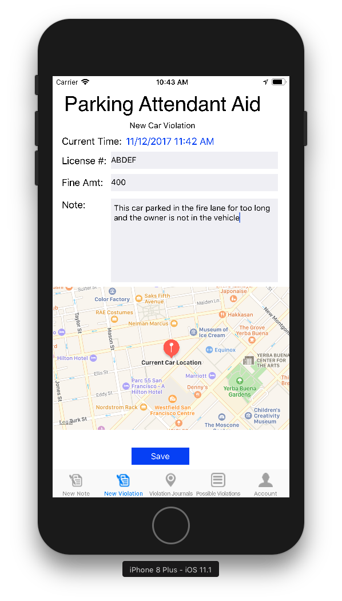

# Parking Attendant iOS App
This is an iOS app that allows parking attendant to take notes and give citation.


## Information
- Student: Sy Le (https://www.linkedin.com/in/syle1021/)
- University Name: San Jose State University (http://www.sjsu.edu/)
- Course: CMPE 297 - Special Topics in Computer/Software Engineering (http://info.sjsu.edu/web-dbgen/catalog/courses/CMPE297.html)


## Repos and Components
There are 2 repos for this project. One of them is the iOS Client to interact with the web app, and the other one is the node js webapp that serves the back end...
- iOS Client (https://github.com/synle/parking-attendant-aid-ios-client)
- Node JS Web App (https://github.com/synle/parking-attendant-aid-web-app)


## Stacks
### Front End (iOS)
- iOS 11
- AlomoFire (Network Requests)


### Web Server
- Node JS
- Express
- Sequelize
- Passport (for authentication)
- Microsoft PowerBI (for dashboard UI)

### Chatbot
- Microsoft LUIS (Language Understanding Intelligent Service)
- Microsofr BotBuilder


## Screenshots




## How to set up
Change the UI host here
https://github.com/synle/parking-attendant-aid-ios-client/blob/master/parkingattendent/AppUtil.swift#L47

```
let appUrl:String = "http://localhost:8080"
```
